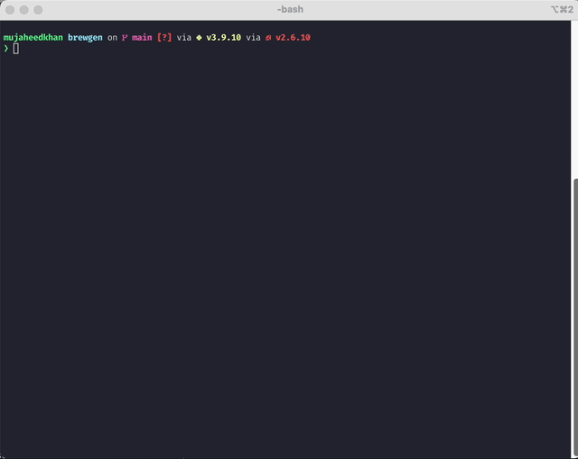

# brewgen

[](LICENSE)


**brewgen** is an AI-powered CLI tool that generates valid [Homebrew](https://brew.sh) formulae from GitHub projects — so you don't have to write them by hand.

## Demo



## Why this exists?

While working on my other project `vid2gif` I found it to be a genuinely handy tool and wanted to make it easily installable via Homebrew so others could benefit from it as well. To do that, I needed to create a Ruby formula file but figuring out how to write one manually turned out to be time-consuming and frustrating. That experience sparked an idea: what if I could automate the process using an LLM to generate a solid starter formula? 

Not only would it streamline the workflow for me but it could also help others publish their tools with minimal friction.

## Features
- Generates Homebrew formulae using local LLMs
- Automatically extracts metadata from GitHub repos
- Computes and injects accurate SHA256
- Adds a test block and install instructions
- Clean, colorful Rich output
- Completely local

## Usage


### Step 1: Start a LLM.
```bash
ollama run llama3
```
### Step 2: Run brewgen
```bash
python3 brewgen.py -r /path/to/your/project -o /path/to/output/folder/project.rb
```

### Options:
```bash
❯ python3 brewgen.py --help

 Usage: brewgen.py [OPTIONS]

 Generate ruby formula file from a cloned repo.


╭─ Options ──────────────────────────────────────────────────────────────────────────────────────────────────────╮
│ --repo-dir            -r      TEXT  Location of where the repo is cloned. [default: None]                      │
│ --output              -o      TEXT  Location of where to save formula file. [default: output.rb]               │
│ --tag                 -t      TEXT  Release tag [default: latest]                                                │
│ --model               -m      TEXT  Name of model. [default: llama3]                                           │
│ --install-completion                Install completion for the current shell.                                  │
│ --show-completion                   Show completion for the current shell, to copy it or customize the         │
│                                     installation.                                                              │
│ --help                              Show this message and exit.                                                │
╰────────────────────────────────────────────────────────────────────────────────────────────────────────────────╯

```

| Option       | Description |
|-------------|-------|
| **--repo-dir**        | Location of where your repo is located. E.g. `/path/to/my/repo.` |
| **--output** | Location of where to save ruby formula. Default: `output.rb` |
| **--tag**     | Specific tag to use. Defaults to getting latest. |
| **--model**  | Name of model. Defaults to `llama`. |

## Requirements

- [Ollama](https://ollama.com)
- Python 3.9+
- requests
- typer[all]
- rich


## How It Works

1. Parses `.git/config` for owner/repo
2. Gets latest tag using GitHub API
3. Downloads tarball and computes `sha256`
4. Extracts metadata from README and LICENSE
5. Feeds structured prompt to LLM
6. Outputs valid Ruby formula


## ⚠️ Disclaimer

This project uses an LLM. Please review the generated formula manually before publishing or submitting to Homebrew/core.

## Limitation(s)

- Output is not always consistent even while using the same LLM.
- Output is mostly correct. Manual verification is required.

## License

MIT © Mujaheed Khan  
See [LICENSE](LICENSE) for details.
